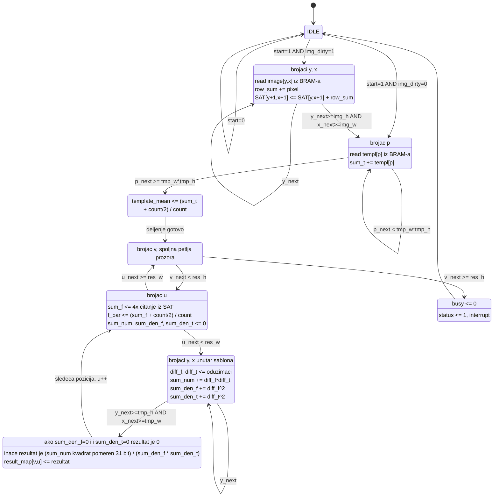
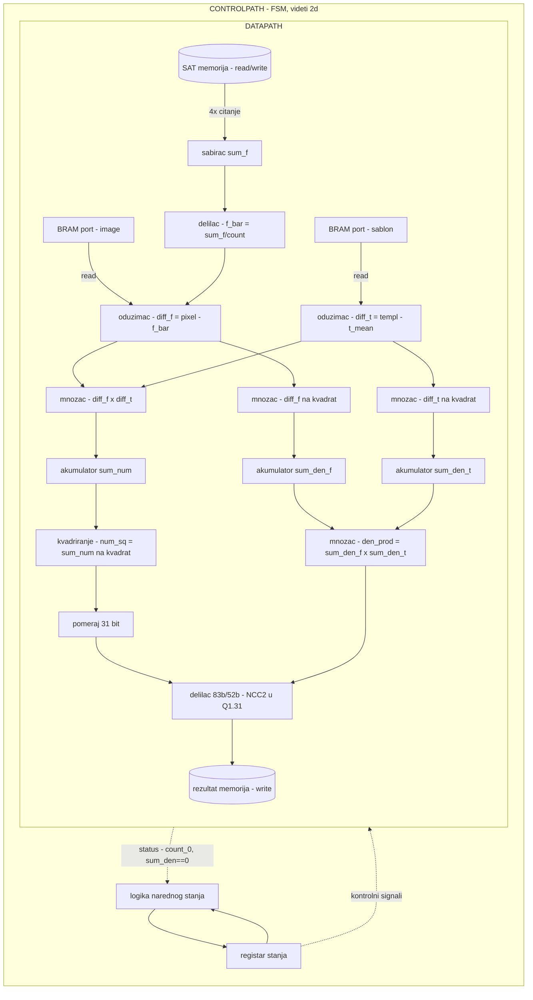

# Korak 2 — Dokumentacija (2a-2e)

> ## ⚠️ ZASTARELO — ISTORIJSKI ZAPIS
>
> Ovaj dokument je pisan **2026-07-20**, pre nego što je RTL napisan, i opisuje
> **prvobitni** dizajn: ASMD sa **9 stanja**, kombinaciona deljenja, `img_dirty`
> optimizacija, kombinaciona čitanja memorija.
>
> **Stvarno implementirani `src/vhdl/ncc_core.vhd` ima 21 stanje**, dva
> sekvencijalna delioca (`seq_divider`, W=18 i W=83), protočnu unutrašnju petlju
> (`S_L_YX_FILL/RUN/DRAIN`), petostepeno sinhrono čitanje SAT (`S_L_U_A..E`) i
> **nema** `img_dirty`. Razlozi svih odstupanja (BRAM inferencija, timing) su
> konkretni i merljivi.
>
> **Merodavna verzija Koraka 2 je PDF dokumentacija:**
> `PSDS_dokumentacija_y25-g10_Korak2-5.pdf`, poglavlja 2-6 (opis algoritma,
> uklanjanje petlji, interfejs, ASMD, datapath/controlpath), sa odeljkom 5.7
> "Evolucija dizajna" koji objašnjava razliku u odnosu na ovaj dokument.
>
> Ovaj fajl se čuva jer 2b (uklanjanje petlji, `if`-`goto` forme) i dalje važi
> doslovno, i jer pokazuje tok projektovanja od algoritma ka RTL-u.

Osnova: `src/hls/ncc_kernel.cpp`/`.hpp` (Korak 1, TDD-testiran, 32/32 tačno na
pravim podacima — videti `01 Razvoj/(C) Plan implementacije (10 koraka).md`).
Metodologija: `01 Razvoj/Vezbe/(C) Vezba 3-5 - RT Modeling.md` (RT/ASMD postupak,
Glava 4 udžbenika). Registarska mapa: `src/common.hpp`.

Napomena o razlici u odnosu na originalni `src/ncc.cpp`: HLS kernel iz Koraka 1
je čista funkcija (poziva se, vrati se, bez skrivenog stanja) — pogodno za
testiranje, ali **ASMD dijagram ispod modeluje pun RTL kontroler** kakav ide u
IP jezgro (Korak 3), koji uključuje `img_dirty` optimizaciju iz originalnog
`ncc_proc()` (SystemC) — HW ne ponavlja učitavanje/SAT izgradnju za isti segment
kad se 6 šablona redom testira na njemu. Ovo NIJE u čistoj C funkciji (nema
smisla za jednokratni poziv), ali JESTE u stvarnom kontroleru koji IP treba da ima.

---

## 2a — Opis algoritma

**Problem:** za dati segment slike table (do 90×90) i šablon figure (do 30×30),
izračunati kvadrat normalizovane unakrsne korelacije (NCC²) u svakoj poziciji
prozora `(u,v)`, `0 ≤ u < img_w-tmp_w+1`, `0 ≤ v < img_h-tmp_h+1`.

**Formula** (γ = korelacija u tački, f = prozor slike, t = šablon):

```
γ(u,v) = Σ[f(x,y) - f̄ᵤᵥ][t(x-u,y-v) - t̄] / √( Σ[f(x,y) - f̄ᵤᵥ]² · Σ[t(x-u,y-v) - t̄]² )
```

**HW optimizacija #1 — izbegavanje korena:** hardver ne računa `γ` nego `γ²`
(poredi se `γ² > 0.75² = 0.5625`), pa se ceo koren izbacuje iz datapath-a:

```
NCC²(u,v) = (Σ diff_f·diff_t)² / (Σ diff_f² · Σ diff_t²)
```

**HW optimizacija #2 — integral image (SAT):** `f̄ᵤᵥ` (srednja vrednost prozora)
bi trivijalno tražila `tmp_w×tmp_h` sabiranja PO SVAKOJ poziciji prozora. Umesto
toga, gradi se summed-area table jednom po segmentu (`build_integral_image`,
O(img_w×img_h)), pa se suma bilo kog prozora dobija u O(1) sa 4 pristupa:

```
sum_f(u,v) = SAT[v+th][u+tw] - SAT[v][u+tw] - SAT[v+th][u] + SAT[v][u]
```

**HW optimizacija #3 — egzaktna celobrojna Q1.31 podela:** originalni SystemC
kod (`ncc.cpp`) računa `ncc2 = (double)num_sq/(double)den_prod` pa množi sa
`2^31`, sa `if (ncc2>1.0) ncc2=1.0` bezbednosnom granicom protiv float
zaokruživanja. HLS kernel (Korak 1) ovo radi kao **tačnu celobrojnu podelu**
`(num_sq << 31) / den_prod` u širem registru (83 bita) — bez ikakvog float
zaokruživanja, pa granica `>1.0` matematički otpada (Cauchy-Schwarz garantuje
`num_sq ≤ den_prod` egzaktno u celobrojnoj aritmetici — dokazano testom, videti
plan fajl).

**Bitska analiza:** sve širine tipova su iz ESL dokumentacije Tabela 2, SA DVE
ISPRAVKE — `diff_f`/`diff_t` (piksel−sredina) i `sum_num` (Σ diff_f·diff_t)
MORAJU biti potpisani (signed), ne unsigned kako tabela doslovno navodi, jer
piksel može biti manji od sredine. Ovo je empirijski dokazano: doslovno
unsigned tumačenje daje pogrešan rezultat na 8 od 9 test tačaka (samo se
slučajno poklopi kad je prozor identičan šablonu, gde se predznaci ponište).
Broj bita (9, 27) ostaje isti kao u dokumentu, menja se samo signedness.

**Ključna odluka projekta (zašto je datapath bit-egzaktan):** `f̄` i
`template_mean` se zaokružuju na ceo broj PRE oduzimanja → `diff_f`/`diff_t` su
egzaktni celi brojevi → nema akumulacije greške zaokruživanja kroz sumiranje
(za razliku od da su ostali float/fixed od početka).

**Promenljiva veličina šablona:** `tmp_w`/`tmp_h` su runtime parametri (registri
`REG_TMP_W`/`REG_TMP_H`), ne kompajl-vremenske konstante — potvrđeno na pravim
podacima gde šabloni variraju od 15×25 (top) do 30×30 (kraljica), sve tačno
prepoznato. Gornja granica `MAX_TMP_W=MAX_TMP_H=30` (i `MAX_IMG_W=MAX_IMG_H=90`)
je kompajl-vremenski budžet statičkih nizova (HLS ne podržava dinamičku
alokaciju), ne pretpostavka o fiksnoj veličini.

**Gde se ovo uklapa u ceo sistem:** ovaj kernel je HW deo (>70% vremena po
profilisanju originalnog MATLAB modela) unutar softverskog coarse-to-fine toka
(`tb.cpp`) — poziva se do 12× po polju (grubi 45×45 screen nad 6 kandidata iste
boje → top-2 → fina potvrda 90×90). Kernel sam ne zna za coarse-to-fine, samo
prima `img_w/h`, `tmp_w/h` kakvi god da jesu po pozivu.

---

## 2b — Uklanjanje petlji (if-goto forma)

ASMD ne ume da modeluje `for`/`while` — pretvaraju se u `if`-`goto` sa
brojačima kao registrima stanja (metodologija: Vezba 3-5, korak 1). Iz
`ncc_kernel.cpp` postoje **3 mesta sa petljama**, ukupno **4 brojača**
(y,x se koriste u dve faze, deljeno resursno — vidi 2e):

### build_integral_image (2 brojača: y, x)

```
y = 0
L1: if (y >= img_h) goto L1_END
        row_sum = 0
        x = 0
    L2: if (x >= img_w) goto L2_END
            row_sum = row_sum + image[y*img_w + x]
            integral[(y+1)*(img_w+1) + (x+1)] = integral[y*(img_w+1)+(x+1)] + row_sum
            x = x + 1
            goto L2
    L2_END:
        y = y + 1
        goto L1
L1_END:
```

### calculate_template_mean (1 brojač: p, linearni indeks 0..tmp_w·tmp_h-1)

```
p = 0; sum = 0
L3: if (p >= tmp_w*tmp_h) goto L3_END
        sum = sum + templ[p]
        p = p + 1
        goto L3
L3_END:
    template_mean = (sum + (count>>1)) / count
```

### glavna petlja: ncc_kernel(v,u) × solve_single_point(y,x) — 4 brojača

```
v = 0
L4: if (v >= res_h) goto L4_END
        u = 0
    L5: if (u >= res_w) goto L5_END
            sum_f  = SAT[(v+th)*(iw+1)+(u+tw)] - SAT[v*(iw+1)+(u+tw)]
                   - SAT[(v+th)*(iw+1)+u]      + SAT[v*(iw+1)+u]
            f_bar  = (sum_f + (count>>1)) / count
            sum_num = 0; sum_den_f = 0; sum_den_t = 0
            y = 0
        L6: if (y >= tmp_h) goto L6_END
                x = 0
            L7: if (x >= tmp_w) goto L7_END
                    diff_f = image[(v+y)*img_w + (u+x)] - f_bar
                    diff_t = templ[y*tmp_w + x] - template_mean
                    sum_num   = sum_num   + diff_f*diff_t
                    sum_den_f = sum_den_f + diff_f*diff_f
                    sum_den_t = sum_den_t + diff_t*diff_t
                    x = x + 1
                    goto L7
            L7_END:
                y = y + 1
                goto L6
        L6_END:
            if (sum_den_f == 0 || sum_den_t == 0)
                result = 0
            else
                result = (sum_num*sum_num << 31) / (sum_den_f*sum_den_t)   -- deljenje
            result_map[v*res_w + u] = result
            u = u + 1
            goto L5
    L5_END:
        v = v + 1
        goto L4
L4_END:
```

**Napomena (`_next` zamka iz Vezbe 3-5):** provera `x >= tmp_w` odmah nakon
`x = x+1` MORA koristiti `x_next` (kombinacionu vrednost), ne `x_reg` (staru
vrednost iz prošlog takta) — inače petlja radi jednu iteraciju viška/manjka.

---

## 2c — Interfejs i okruženje

RT metodologija traži 4 interfejsa (Vezba 3-5, korak 2). Mapiranje na
`common.hpp` (već postoji, dizajniran da liči na AXI-Lite):

| RT interfejs | Konkretno kod nas |
|---|---|
| **Komandni** (min. `start`) | `REG_IMG_W/H`, `REG_TMP_W/H`, `REG_IMG_ADDR`, `REG_TMP_ADDR` (konfiguracija PRE starta) + `REG_CTRL` (upis 1 = start) |
| **Statusni** (min. `ready`) | `REG_STATUS` (0=busy, 1=done) |
| **Ulazni podaci** | NIJE na portu — čita se preko **BRAM master porta** (`i_bram` u `ncc.hpp`, AXI Master u pravom HW-u): adresa+read-data par, kao `a_addr_o`/`a_data_i` iz primera u Vezbi 3-5 |
| **Izlazni podaci** | Upisuju se u rezultatsku memoriju; CPU ih čita preko `ADDR_RESULTS` (u pravom HW-u: poseban write port ka BRAM-u ili rezultatskoj memoriji) |

Širina izlaznog porta se izvodi funkcionalno iz širine ulaza (Vezba 3-5, korak
2): `result_t` je 32 bita jer `num_sq`/`den_prod` (52 bita svaki) posle
skaliranja `<<31` i podele stanu u 32-bitni nenegativan rezultat (dokazano
testom da nikad ne pređe `2^31`).

**Okruženje** (`vp.cpp`/`bram.cpp`/`dma.cpp`): BRAM je deljeni multi-master
bafer (CPU, DMA, NCC0, NCC1) — NCC je JEDAN od mastera na BRAM portu, ne
vlasnik. Adresna mapa (`ADDR_BRAM=0x4000_0000`, `ADDR_NCC=0x5000_0000`,
`ADDR_NCC1=0x5100_0000`) direktno postaje AXI adresni prostor u block
design-u (Korak 7).

---

## 2d — ASMD dijagram

Stanja (proširenje FSM-a iz originalnog `ncc_proc()`, sa RT operacijama iz 2b):



**Uslovni prelazi i uslovni izlazi** (ASMD "condition box"/"conditional
output"): grananje `IDLE→LOAD_IMG` vs `IDLE→LOAD_TMPL` (uslov `img_dirty`) i
`WRITE_RESULT→L_U` vs implicitni povratak na `L_V` kad `u` pređe `res_w` su
tačno ti condition/conditional-output elementi — u VHDL-u dvoprocesnim stilom
(Vezba 3-5) ovo su `if` grane unutar `case state_reg is` bloka kombinacionog
procesa.

**Trivijalne RT operacije u IDLE** (obavezno po Vezbi 3-5, inače latch-evi):
`busy <= busy` (default assignment), svi akumulatori zadržavaju vrednost dok
se ne uđe u odgovarajuće stanje.

**Napomena o memorijskom kašnjenju:** `LOAD_IMG`/`LOAD_TMPL` čitanja iz BRAM-a
su sinhrona (1 takt kašnjenja) — adresa se mora postaviti JEDAN takt pre nego
što je podatak validan, isto pravilo kao memorijski primer iz Vezbe 3-5. Ovo
odgovara `wait(scratch)` posle `b_transport` u `read_from_bram` (SystemC
model) — u pravom RTL-u to je registarsko kašnjenje sinhrone BRAM primitive,
ne `wait()`.

---

## 2e — Datapath / Controlpath blok dijagram

### Registri (identifikovani iz 2b, grupisani po odredišnom registru — Vezba 3-5 korak 4)

| Registar | Širina | Upisuje se u stanju |
|---|---|---|
| `img_w,img_h,tmp_w,tmp_h,img_addr,tmp_addr` | prema komandnim registrima | IDLE (na start) |
| `y,x` (deljeno: SAT izgradnja I unutrašnja petlja šablona — nisu aktivni istovremeno) | dovoljno za max(img_h,tmp_h)=90 → 7 bita | LOAD_IMG, L_YX |
| `v,u` | dovoljno za res_h,res_w ≤ 90 → 7 bita | L_V, L_U |
| `SAT[]` (integral image) | `ap_uint<32>`, (91×91) memorija | LOAD_IMG |
| `f_bar`, `template_mean` | `ap_uint<8>` | L_U (f_bar), CALC_MEAN (template_mean) |
| `sum_num` | `ap_int<27>` (ISPRAVKA: signed) | L_YX (akumulator) |
| `sum_den_f`, `sum_den_t` | `ap_uint<26>` | L_YX (akumulatori) |
| `num_sq`, `den_prod` | `ap_uint<52>` | WRITE_RESULT (kombinaciono) |
| `result` | `ap_uint<32>` | WRITE_RESULT |
| `img_dirty` | 1 bit | postavlja SW upisom `REG_IMG_ADDR`, briše HW u LOAD_IMG |

### Funkcionalne jedinice



### 4 odvojene memorije (po uzoru na "3-memorije sweet-spot" iz Vezbe 3-5, korak "Memorijski interfejs")

| Memorija | Pristup | Port |
|---|---|---|
| Slika (segment) | read | BRAM master (deljen sa CPU/DMA/drugim NCC) |
| Šablon | read | isti BRAM master, druga adresa |
| Integral image (SAT) | read/write | interna, privatna za NCC blok (nije vidljiva CPU-u) |
| Rezultat | write (HW upisuje) / read (CPU čita) | isti BRAM prostor, `ADDR_RESULTS` offset |

Slika i šablon dele isti fizički BRAM (multi-master, `bram.cpp`), ali su
logički odvojene regije — u smislu Vezbe 3-5 "3 odvojene jednopristupne
memorije" pattern-a, integral image je JEDINA memorija koja realno treba
sopstveni privatni (ne deljeni) port, jer se piše I čita u istom prolazu
(LOAD_IMG faza) sa visokom učestalošću.

### Deljenje resursa (Resource Sharing) — otvoreno pitanje za Korak 3

3 množenja po iteraciji unutrašnje petlje (`diff_f×diff_t`, `diff_f²`,
`diff_t²`) — dijagram iznad pretpostavlja **3 odvojena množača** (brže,
paralelno u istom taktu, iskorišćava DSP48E blokove). Ovo se poklapa sa
stvarnim HLS izveštajem (16× DSP48E po instanci, ESL dokumentacija) — dovoljno
za nekoliko paralelnih MAC lanaca. Alternativa (1 deljeni množač + ulazni mux)
štedi DSP ali usporava — odluka se donosi kroz HLS pragma eksperimente u
Koraku 3 (`PIPELINE`/`ALLOCATION`), ne ovde; dijagram dokumentuje
**podrazumevanu (nesmanjenu) topologiju** pre optimizacije.

---

## Status

- [x] 2a Opis algoritma
- [x] 2b Uklanjanje petlji
- [x] 2c Interfejs i okruženje
- [x] 2d ASMD dijagram
- [x] 2e Blok dijagram datapath/controlpath

**Korak 2 završen 2026-07-20.**
